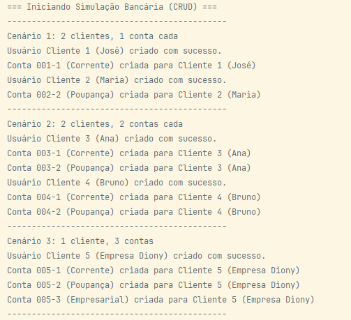

Desafio Prático: Gestão de Banco com POO

Este projeto é uma simulação de um sistema de gestão bancária, desenvolvido como atividade prática de Programação Orientada a Objetos. O sistema permite o gerenciamento completo de usuários e suas respectivas contas bancárias, com todas as operações de CRUD (Criar, Ler, Atualizar, Deletar) sendo executadas em memória através de ArrayLists.

O foco do projeto é aplicar os conceitos de POO para criar um sistema coeso e encapsulado, onde cada classe possui sua responsabilidade bem definida.

1. Diagrama de Classes (UML)

O diagrama abaixo ilustra a arquitetura do sistema, mostrando como as classes Usuario, ContaBancaria, Operacao e Banco se relacionam.

2. Estrutura das Classes e Responsabilidades (POO)

O sistema foi dividido nas seguintes classes para garantir alta coesão e baixo acoplamento:

Operacao: Representa uma única transação (Depósito ou Saque). É responsável por armazenar o tipo, valor e a data/hora da transação, além de formatar a si mesma para o extrato (método toString()).

ContaBancaria: Representa uma conta. É responsável por gerenciar seu próprio saldo e sua lista (ArrayList) de Operacao (o extrato). Contém os métodos depositar(), sacar() e consultarExtrato().

Usuario: Representa um cliente. É responsável por gerenciar seus dados pessoais (nome, CPF) e sua lista (ArrayList) de ContaBancaria.

Banco: É a classe de serviço (ou "Facade") do sistema. Ela centraliza toda a lógica de negócio e as operações de CRUD (add(), remove(), get(), set()). Ela gerencia as listas principais de Usuario e ContaBancaria, garantindo que as regras sejam aplicadas (ex: não criar usuário com CPF duplicado).

Main: É a classe de inicialização. Sua única responsabilidade é instanciar o Banco e executar os cenários de teste solicitados pela atividade, demonstrando o funcionamento do sistema.

3. Funcionalidades Implementadas (CRUD)

A classe Banco implementa todas as operações de CRUD solicitadas:

Create: criarUsuario(nome, cpf), criarConta(cpfUsuario, num, tipo).

Read: buscarUsuario(cpf), buscarConta(numConta), listarTodasContas(), listarContasPorCpf(cpf).

Update: atualizarUsuario(cpf, novoNome) (demonstra o uso de set()).

Delete: removerUsuario(cpf), removerConta(numConta) (demonstra o uso de remove()).

Além disso, as classes ContaBancaria e Usuario também usam add() e remove() para gerenciar suas listas internas (extrato e contas).

4. Cenários de Teste (Execução)

A classe Main.java foi configurada para executar e demonstrar todos os cenários exigidos pela atividade:

Cenário 1: 2 clientes com 1 conta bancária cada.

Cenário 2: 2 clientes com 2 contas bancárias cada.

Cenário 3: 1 cliente com 3 contas (Corrente, Poupança, Empresarial).

Movimentações: Todas as contas criadas realizam depósitos e saques para popular o extrato.

Listagens: O Main demonstra a listarTodasContas() e a listarContasPorCpf().

Extrato: O Main demonstra a consultarExtrato() de contas específicas.

CRUD: O Main demonstra as operações de atualizarUsuario() (Update) e removerUsuario() (Delete).

5. Como Executar

Clone este repositório.

Abra o projeto em uma IDE Java (ex: IntelliJ ou Eclipse).

Execute o arquivo Main.java (localizado no pacote banco).

Observe a saída no console, que demonstrará a execução de todos os cenários e operações.